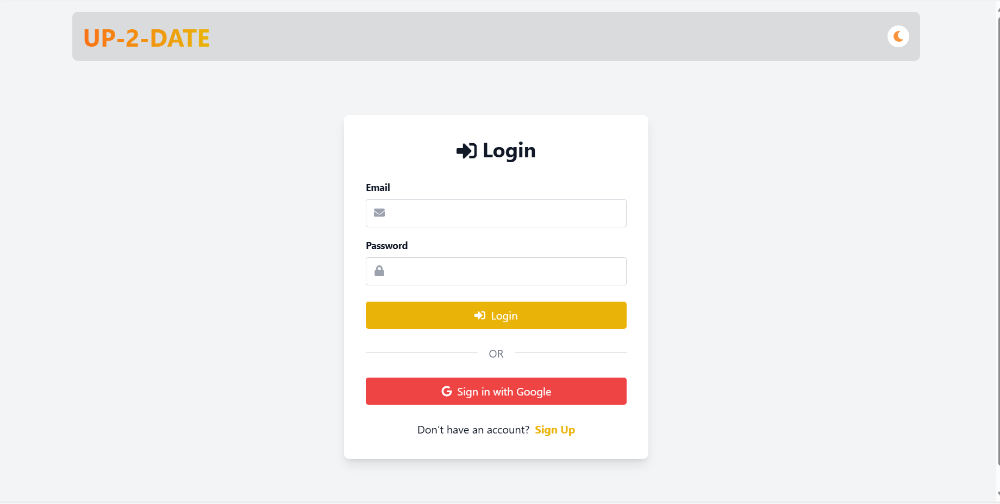
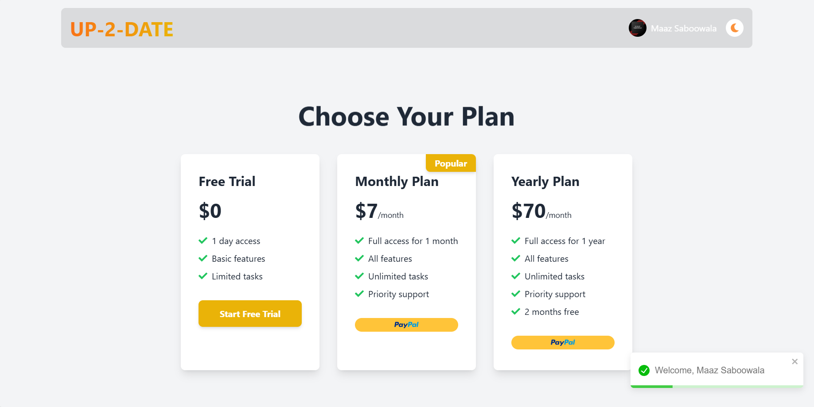
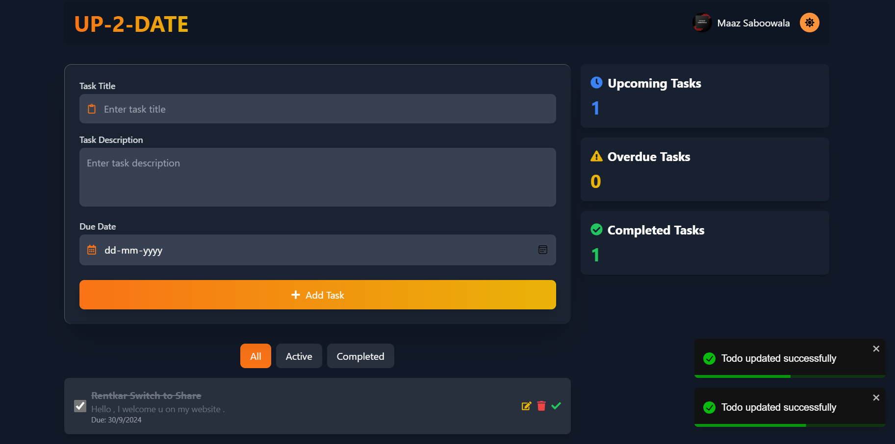
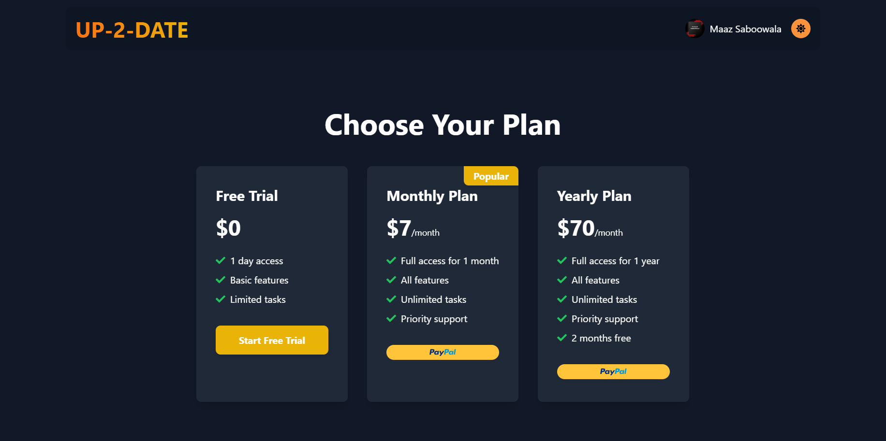
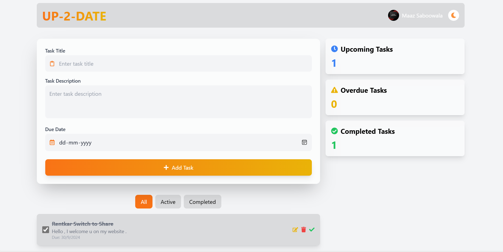
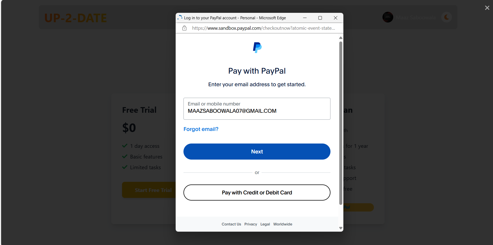

# TodoApp Pro 🚀

TodoApp Pro is a feature-rich task management application that combines powerful todo functionality with user authentication and premium subscription plans.


## 🌟 Features

### 🔐 Secure Authentication
Powered by Firebase, our authentication system ensures your data stays private and secure.

- Easy sign-up process
- Secure login with email/password or social media accounts
- Password reset functionality

### 💰 Flexible Pricing Plans
Choose the plan that fits your needs:

- **Free Trial**: Experience premium features for 1 day
- **Monthly Plan**: $7/month for continuous access
- **Yearly Plan**: $70/year (Save 16%!)

### ✅ Powerful Todo Management
Stay organized and boost your productivity with our intuitive todo system.

- Create, edit, and delete tasks effortlessly
- Categorize todos with tags
- Set priorities and due dates
- Filter and sort your tasks

### 🌓 Dark/Light Mode
Work comfortably day or night with our sleek dark and light themes.



### 💳 Secure PayPal Gateway
Manage your subscription with ease using our integrated PayPal payment system.

- Secure payment processing
- Easy subscription management
- Automatic renewals

## 🛠 Technology Stack
- **Frontend**: React.js with Redux Toolkit for state management
- **Styling**: Tailwind CSS for a responsive and modern UI
- **Backend**: Node.js and Express.js
- **Database**: MongoDB with Mongoose ODM
- **Authentication**: Firebase Authentication
- **Payment Processing**: PayPal API

## 🚀 Getting Started

1. **Clone the Repository**
   ```bash
   git clone https://github.com/MaazS07/UP2DATE.git
   cd todoapp-pro

## 🚀 Getting Started

1. Clone the repository
   ```
   git clone https://github.com/MaazS07/UP2DATE.git
   cd todoapp-pro
   ```

2. Install dependencies
   ```
   npm install
   ```

3. Set up environment variables
   Create a `.env` file in the root directory and add the following:
   ```
   MONGODB_URI=your_mongodb_connection_string
   FIREBASE_CONFIG=your_firebase_config_json
   PAYPAL_CLIENT_ID=your_paypal_client_id
   PAYPAL_SECRET=your_paypal_secret
   ```

4. Run the development server
   ```
   npm run dev
   ```

5. Open your browser and navigate to `http://localhost:3000`

## 📚 API Documentation

### Authentication Endpoints
- `POST /api/auth/signup`: Create a new user account
- `POST /api/auth/login`: Log in an existing user

### PayPal Integration
- `POST /api/create-paypal-order`: Create a new PayPal order
- `POST /api/capture-paypal-order`: Capture a PayPal payment

### Todo Management
- `GET /api/todos`: Fetch all todos for the authenticated user
- `POST /api/todos`: Create a new todo
- `PUT /api/todos/:id`: Update an existing todo
- `DELETE /api/todos/:id`: Delete a todo


Made by Maaz Saboowala
